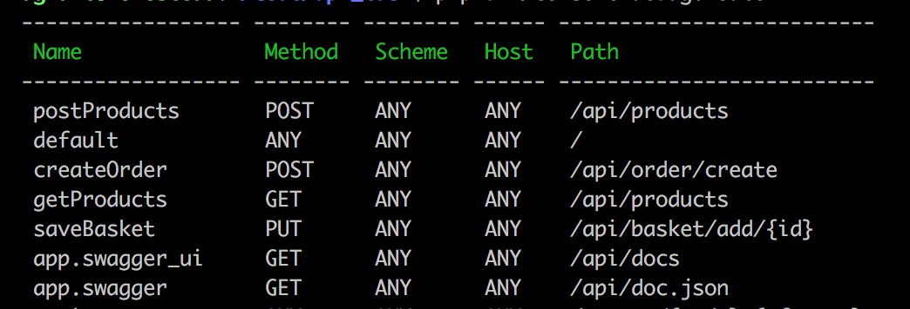

# How to start

```shell
git clone git@github.com:leobeal/api_demo.git
cd api_demo

cp env.dist .env

composer install

```
- Adjust DB settings in `.env`
```shell
#Creates the db
php bin/console doctrine:database:create
#Creates tables
php bin/console doctrine:schema:update --force
#Creates dummy products
php bin/console doctrine:fixtures:load --append
```

# Routes available



# Online example

The docs for a working version of this demo can be found [here](https://leobeal.com/api/docs). Products can be seen [here](https://leobeal.com/api/products)

## Using Postman

A Json postman colletion is available for convinient testing of the application.
It can be found [here](public/postman_collection.json) or [here](https://leobeal.com/postman_collection.json)


# Docs
Api docs are available under /docs.  Calls made to the api from docs might not work, as authentication is required. Use postman instead.

# Permissions
- Admins can create products and bundles.
- Normal users can see products, add a product to a cart, and create an order.

Before you are able to run the application, the user table need to be populated, as requests to 

```sql
insert into category (name, created_at, updated_at) values ("Category name", NOW(), NOW());

INSERT INTO `user` (`id`, `username`, `api_key`, `created_at`, `updated_at`)
VALUES
	(1, 'normal user', 'api_key_user',  NOW(),  NOW()),
	(2, 'admin user', 'api_key_admin',  NOW(),  NOW());
```

# Running tests

`./vendor/bin/simple-phpunit`